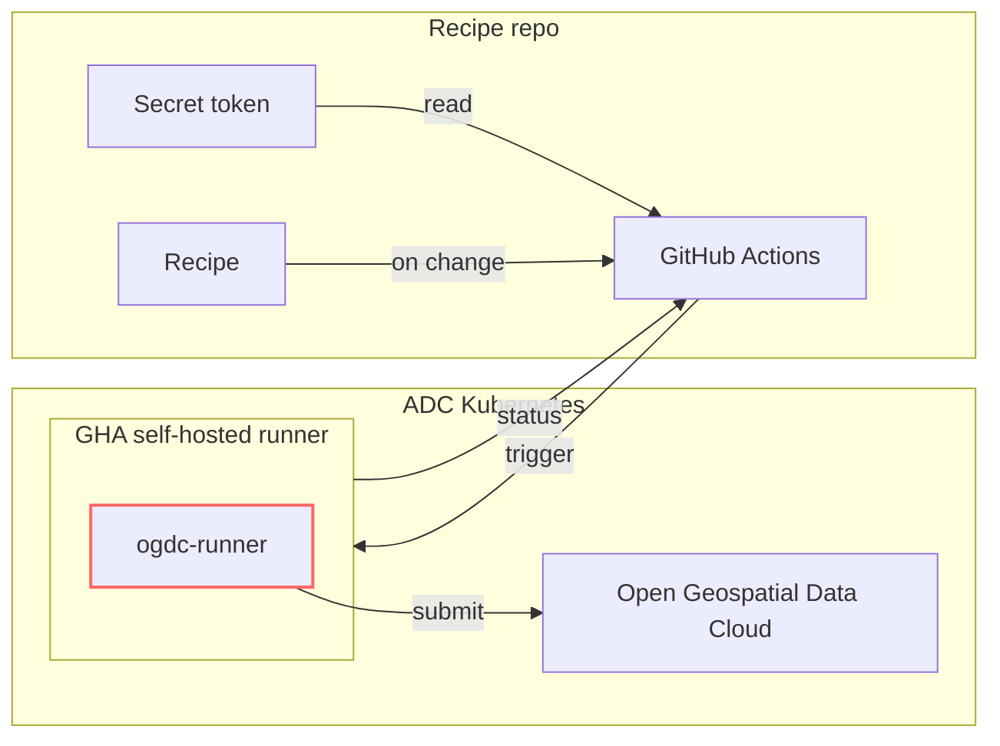

# ogdc-runner

<!-- SPHINX-START -->

[![Actions Status][actions-badge]][actions-link]
[![Documentation Status][rtd-badge]][rtd-link]

[![PyPI version][pypi-version]][pypi-link]
[![Conda-Forge][conda-badge]][conda-link]
[![PyPI platforms][pypi-platforms]][pypi-link]

[![GitHub Discussion][github-discussions-badge]][github-discussions-link]



[Please view our main documentation site for context](https://qgreenland-net.github.io).

This component:

- defines and documents the recipe API(s)
- accepts a recipe as input and submits it to the OGDC for execution

```bash
ogdc-runner submit /path/to/ogdc-recipes/my-recipe
```

Or:

```bash
ogdc-runner submit https://github.com/QGreenland-Net/ogdc-recipes/ my-recipe
```

## Implementation notes

- `ogdc-runner` could be a Python program
- The trigger/status interface could be handled (transparently?) by a GitHub
  Actions self-hosted runner.

## Contributing

See [./docs/CONTRIBUTING.md](./docs/CONTRIBUTING.md) for information about
developing `ogdc-runner`.

<!-- prettier-ignore-start -->
[actions-badge]:            https://github.com/qgreenland-net/ogdc-runner/workflows/CI/badge.svg
[actions-link]:             https://github.com/qgreenland-net/ogdc-runner/actions
[conda-badge]:              https://img.shields.io/conda/vn/conda-forge/ogdc-runner
[conda-link]:               https://github.com/conda-forge/ogdc-runner-feedstock
[github-discussions-badge]: https://img.shields.io/static/v1?label=Discussions&message=Ask&color=blue&logo=github
[github-discussions-link]:  https://github.com/qgreenland-net/ogdc-runner/discussions
[pypi-link]:                https://pypi.org/project/ogdc-runner/
[pypi-platforms]:           https://img.shields.io/pypi/pyversions/ogdc-runner
[pypi-version]:             https://img.shields.io/pypi/v/ogdc-runner
[rtd-badge]:                https://readthedocs.org/projects/ogdc-runner/badge/?version=latest
[rtd-link]:                 https://ogdc-runner.readthedocs.io/en/latest/?badge=latest
<!-- prettier-ignore-end -->
