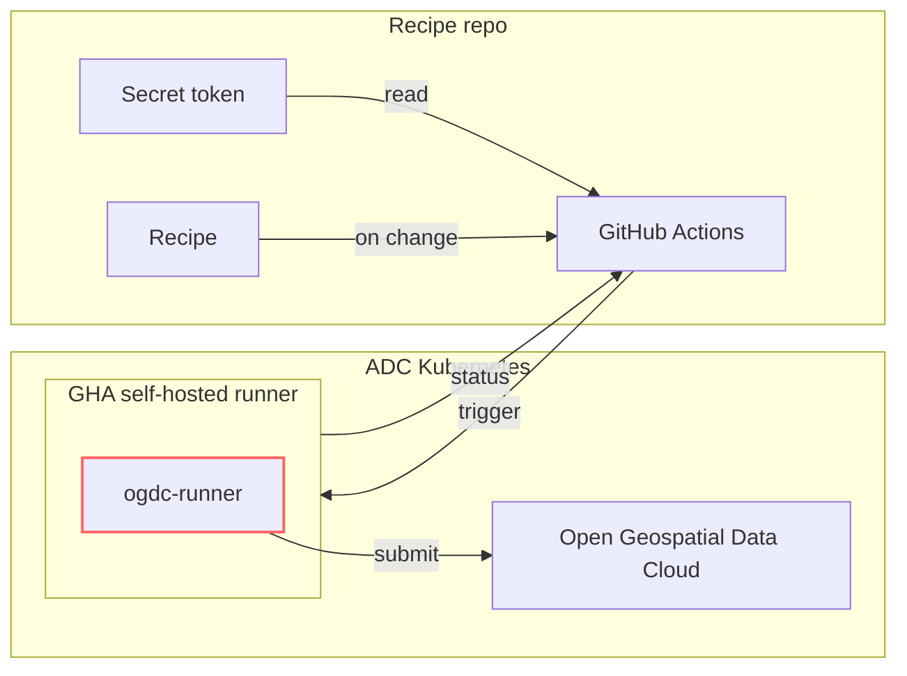

# ogdc-runner



[Please view our main documentation site for context](https://qgreenland-net.github.io).

This component:

* defines and documents the recipe API(s)
* accepts a recipe as input and submits it to the OGDC for execution

```bash
ogdc-runner /path/to/ogdc-recipes/my-recipe
```

Or:

```bash
ogdc-runner https://github.com/QGreenland-Net/ogdc-recipes/ my-recipe
```


## Implementation notes

* `ogdc-runner` could be a Python program
* The trigger/status interface could be handled (transparently?) by a GitHub Actions
  self-hosted runner.
